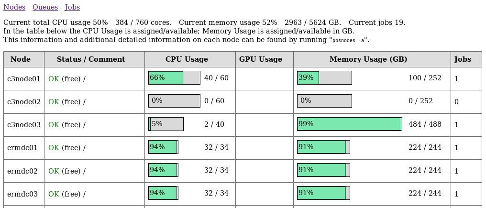

# README

## Introduction

This small web application provides a simple web view of the nodes, queues and jobs 
on a High Performance Computer Cluster running the PBS batch scheduling system.
It was developed using PBS Professional but should also work with the open source PBS.
General information on PBS can be found at its Wikipedia entry 
[Portable Batch System](https://en.wikipedia.org/wiki/Portable_Batch_System) and the 
[PBS Professional Open Source Project](https://www.pbspro.org) homepage.
This project is hosted at the eResearch site at Github <https://github.com/UTS-eResearch/pbsweb>

  
Screenshot showing the web application.

## Files and Directories

Files:

    pbsweb.py               The main pbsweb application.
    pbsutils.py             Module containing utility functions for the pbsweb application.
    swig_compile_pbs.sh     Run this to create _pbs.so
    pbs.i                   Used by swig_compile_pbs.sh
    requirements.txt        Python requirements file.
    pbsweb.ini              Example uWSGI file for this app.
    install.sh              Installs files into production.

    tests/test_pbs_jobs.py         Prints the current jobs and their attributes. 
    tests/test_pbs_nodes_all.py    Prints all nodes and their attributes. 
    tests/test_pbs_queues.py       Prints the queues and their attributes.

Directories:

    static/  Contains static resources like stylesheets.
    views/   Contains templates for the pbsweb bottle application.
    tests/   Contains all the tests.

## Software Required

* PBS Professional commercial or open source
  You will need the file `pbs_ifl.h` from your PBS installation.
* gcc 
* openssl-devel 
* SWIG - Software Wrapper and Interface Generator
* Python 2.7 development packages 
* Python 2.7 virtual environment with:
  - bottle      Bottle micro web framework
  - Jinja2      Jinja2 templating engine 
  - uWSGI       To run the web app
* apache or nginx

Details are provided in the Installation Notes. 

## License

Copyright 2019 Mike Lake, eResearch

This program is free software: you can redistribute it and/or modify it
under the terms of the GNU General Public License as published by the Free Software 
Foundation, either version 3 of the License, or (at your option) any later version.

This program is distributed in the hope that it will be useful, but
WITHOUT ANY WARRANTY; without even the implied warranty of MERCHANTABILITY or
FITNESS FOR A PARTICULAR PURPOSE. See the GNU General Public License for more
details.

You should have received a copy of the GNU General Public License along with
Data Directory Cataloger. If not, see https://www.gnu.org/licenses/.

## References

Information on the "Batch Interface Library" can be found in the "PBS Professional® Programmer's Guide". 
See the section "Batch Interface Library".
This is the primary API to communicate with the PBS MoM. 

Bottle Python Web Framework: <https://bottlepy.org/docs/0.12/>

SWIG Tutorial: <http://www.swig.org/tutorial.html>

